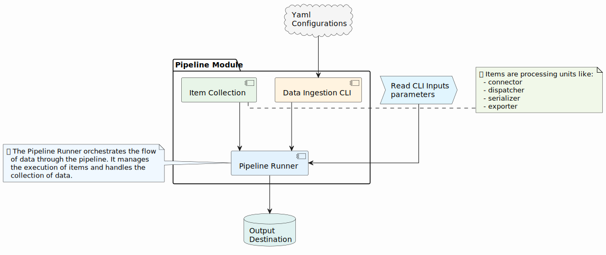
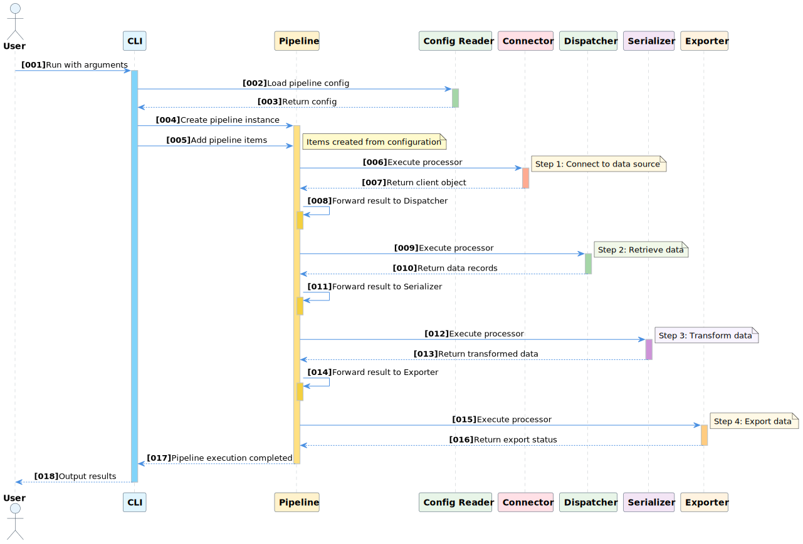

# ADaPT Pipeline - Pipeline Orchestration Package

**Pipeline orchestration and execution engine for the ADaPT ecosystem.**

[](https://opensource.org/licenses/Apache-2.0)
[](https://www.python.org/downloads/)

## 🚀 Overview

The `adapt-pipeline` package provides the orchestration layer for the ADaPT (Adaptive Data Pipeline Toolkit) ecosystem. It coordinates the execution of data pipelines by integrating connectors, serializers, and utilities into cohesive workflows. This package includes the main CLI interface and pipeline management capabilities.

### Pipeline Architecture



The pipeline package orchestrates the entire data processing workflow:
- **Pipeline Engine**: Core orchestration logic
- **CLI Interface**: Command-line interface for pipeline execution
- **Configuration Manager**: Handles pipeline configuration and validation
- **Workflow Executor**: Manages sequential and parallel execution

### Pipeline Execution Flow



The pipeline execution follows these steps:
1. **Configuration Loading**: Parse pipeline and component configurations
2. **Initialization**: Set up connectors, serializers, and utilities
3. **Data Extraction**: Use connectors to retrieve data from sources
4. **Data Transformation**: Apply serializers to transform and normalize data
5. **Data Export**: Export processed data to specified destinations
6. **Cleanup**: Handle resources and generate execution reports

## 📦 Features

- **🎯 Pipeline Orchestration**: Coordinate complex data workflows
- **🖥️ CLI Interface**: Command-line tool for pipeline execution
- **⚙️ Configuration-Driven**: YAML-based pipeline definitions
- **🔄 Workflow Management**: Sequential and parallel execution support
- **🛠️ Error Handling**: Comprehensive error management and logging
- **📊 Progress Tracking**: Real-time pipeline execution monitoring
- **🔌 Extensible**: Support for custom pipeline items and processors

## 🛠️ Installation

### Option 1: Install from Source (Recommended)
```bash
git clone https://github.com/karthick-jaganathan/ADaPT-ETL.git
cd ADaPT-ETL/adapt/pipeline
pip install .
```

### Option 2: Development Installation
```bash
git clone https://github.com/karthick-jaganathan/ADaPT-ETL.git
cd ADaPT-ETL/adapt/pipeline
pip install -e .
```

### Option 3: As Part of Complete ADaPT Installation
```bash
git clone https://github.com/karthick-jaganathan/ADaPT-ETL.git
cd ADaPT-ETL
make install  # Installs all packages including pipeline
```

### Option 4: Build and Install Distribution
```bash
git clone https://github.com/karthick-jaganathan/ADaPT-ETL.git
cd ADaPT-ETL/adapt/pipeline
python setup.py sdist
pip install dist/adapt-pipeline-0.0.1.tar.gz
```

## 📋 Dependencies

This package automatically installs the following dependencies:
- **adapt-utils**: Core utilities and configuration management
- **adapt-connector**: Data source connectors and API integrations
- **adapt-serializer**: Data transformation and serialization

## ⚙️ Environment Variables

The pipeline package requires the following environment variables:

```bash
# Required: Path to configuration files directory
export ADAPT_CONFIGS="/path/to/your/configs"

# Optional: Output directory for processed data (defaults to /tmp)
export ADAPT_OUTPUT_DIR="/path/to/output"

# Example for development
export ADAPT_CONFIGS="$(pwd)/configs"
export ADAPT_OUTPUT_DIR="/data/adapt_etl"
```

## 🚀 Usage

### Command Line Interface

The package provides the `adapt_pipeline` command for executing data pipelines:

```bash
# Basic usage
adapt_pipeline --help

# Google Ads pipeline example
adapt_pipeline --namespace google \
  --pipeline-config data_ingestion.yaml \
  --data-ingestion-config campaign.yaml \
  --auth-data client_id="your-client-id" \
  --auth-data client_secret="your-client-secret" \
  --auth-data developer_token="your-developer-token" \
  --auth-data login_customer_id="your-login-customer-id" \
  --auth-data refresh_token="your-refresh-token" \
  --external-input customer_id="your-customer-id" \
  --external-input advertising_channel_type="SEARCH,SHOPPING"

# Facebook Ads pipeline example
adapt_pipeline --namespace facebook \
  --pipeline-config data_ingestion.yaml \
  --data-ingestion-config campaign.yaml \
  --auth-data refresh_token="your-access-token" \
  --auth-data account_id="act_your-account-id" \
  --auth-data consumer_key="your-consumer-key" \
  --auth-data consumer_secret="your-consumer-secret" \
  --external-input campaign_ids="comma-separated-campaign-ids"
```

#### CLI Parameters

| Parameter | Description | Required | Example |
|-----------|-------------|----------|---------|
| `--namespace` | Service namespace (your_service, api_name) | Yes | `--namespace your_service` |
| `--pipeline-config` | Pipeline configuration file | Yes | `--pipeline-config data_ingestion.yaml` |
| `--data-ingestion-config` | Data ingestion configuration | Yes | `--data-ingestion-config campaign.yaml` |
| `--auth-data` | Authentication parameters | Yes | `--auth-data client_id="value"` |
| `--external-input` | External input parameters | Yes | `--external-input customer_id="123456"` |
| `--output-dir` | Override output directory | No | `--output-dir /custom/path` |
| `--verbose` | Enable verbose logging | No | `--verbose` |

### Python API

```python
from adapt.pipeline import pipeline
from adapt.utils import Store

# Create external input store
external_input = Store()
external_input.add('resource_id', '123456789')
external_input.add('entity_ids', '111,222,333')

# Create and configure pipeline
data_pipeline = pipeline.Pipeline()

# Load pipeline configuration
pipeline_config = {
    "version": "1.0",
    "kind": "pipeline",
    "pipeline": {
        "type": "list",
        "items": [
            {
                "name": "connector_config",
                "client": {
                    "type": "callable",
                    "module": "adapt.utils.config_reader",
                    "class": "YamlReader",
                    "method": "load_from_config_location"
                }
            }
        ]
    }
}

# Execute pipeline
result = data_pipeline.execute(pipeline_config, external_input)
```

## 📁 Configuration Structure

Pipeline configurations should follow this directory structure:

```
configs/
├── pipeline/
│   └── data_ingestion.yaml      # Pipeline orchestration
├── connector/
│   ├── your_service/
│   │   └── data_config.yaml     # Service connector config
│   └── another_api/
│       └── endpoint_config.yaml # Another API connector config
├── serializer/
│   ├── your_service/
│   │   └── data_transform.yaml  # Service data transformation
│   └── another_api/
│       └── data_mapping.yaml    # Another API data transformation
└── authorization/
    ├── your_service/
    │   └── authorization.yaml   # Service authentication
    └── another_api/
        └── authorization.yaml   # Another API authentication
```

### Pipeline Configuration Example

```yaml
version: 1.0
kind: pipeline
description: "Generic data ingestion pipeline"

pipeline:
  type: list
  items:
    - name: connector_config
      client:
        type: callable
        module: adapt.utils.config_reader
        class: YamlReader
        method: load_from_config_location
      arguments:
        type: dict
        items:
          module:
            type: constant
            value: connector
          namespace:
            type: external_input
            key: namespace
          config_name:
            type: external_input
            key: data_ingestion_config
    
    - name: service
      client:
        type: callable
        module: adapt.connector.service
        class: Service
        method: initialize
      arguments:
        type: dict
        items:
          config:
            type: external_input
            key: connector_config
          external_input:
            type: external_input
            key: external_input
    
    - name: serializer_config
      client:
        type: callable
        module: adapt.utils.config_reader
        class: YamlReader
        method: load_from_config_location
      arguments:
        type: dict
        items:
          module:
            type: constant
            value: serializer
          namespace:
            type: external_input
            key: namespace
          config_name:
            type: external_input
            key: data_ingestion_config
    
    - name: serializer
      client:
        type: callable
        module: adapt.serializer.serializer
        class: Serializer
        method: init
      arguments:
        type: external_input
        key: serializer_config
    
    - name: export
      client:
        type: callable
        module: adapt.utils.exporter
        class: CSVExporter
        method: lazy_run
      arguments:
        type: dict
        items:
          config:
            type: external_input
            key: serializer_config
          records:
            type: callable
            module: adapt.serializer.serializer
            class: Serializer
            method: serialize_records
            arguments:
              type: dict
              items:
                serializer:
                  type: external_input
                  key: serializer
                records:
                  type: external_input
                  key: service
```

## 🔧 Advanced Usage

### Custom Pipeline Items

Create custom pipeline items by extending the base pipeline functionality:

```python
from adapt.pipeline.pipeline_item import PipelineItem

class CustomProcessor(PipelineItem):
    def __init__(self, config):
        super().__init__(config)
        self.config = config
    
    def execute(self, context):
        # Custom processing logic
        data = context.get('input_data')
        processed_data = self.process(data)
        context.add('processed_data', processed_data)
        return context
    
    def process(self, data):
        # Implement your custom processing
        return data
```

### Error Handling

The pipeline includes comprehensive error handling:

```python
from adapt.pipeline import pipeline
from adapt.pipeline.exceptions import PipelineExecutionError

try:
    result = data_pipeline.execute(config, external_input)
except PipelineExecutionError as e:
    print(f"Pipeline execution failed: {e}")
    print(f"Failed at step: {e.step}")
    print(f"Error details: {e.details}")
```

### Logging and Monitoring

Enable detailed logging for pipeline execution:

```python
import logging

# Configure logging
logging.basicConfig(
    level=logging.INFO,
    format='%(asctime)s - %(name)s - %(levelname)s - %(message)s'
)

# Execute pipeline with logging
result = data_pipeline.execute(config, external_input, verbose=True)
```

## ✅ Verification

Verify your installation:

```bash
# Check package installation
pip show adapt-pipeline

# Test CLI tool
adapt_pipeline --help

# Test Python import
python -c "import adapt.pipeline; print('✅ Pipeline package imported successfully!')"

# Verify dependencies
python -c "import adapt.utils, adapt.connector, adapt.serializer; print('✅ All dependencies available!')"
```

## 🐳 Docker Usage

The pipeline can be executed in Docker containers:

```bash
# Using Docker Compose
docker-compose exec adapt-etl adapt_pipeline --namespace google \
  --pipeline-config data_ingestion.yaml \
  --data-ingestion-config campaign.yaml \
  # ... additional parameters

# Using Docker directly
docker run -it --rm \
  -v $(pwd)/configs:/configs:ro \
  -v /data/adapt_etl:/data/adapt_etl \
  -e ADAPT_CONFIGS=/configs \
  -e ADAPT_OUTPUT_DIR=/data/adapt_etl \
  adapt-etl adapt_pipeline --namespace facebook \
  --pipeline-config data_ingestion.yaml \
  --data-ingestion-config campaign.yaml \
  # ... additional parameters
```

## 🔍 Troubleshooting

### Common Issues

1. **Missing Environment Variables**
   ```bash
   Error: ADAPT_CONFIGS environment variable not set
   Solution: export ADAPT_CONFIGS="/path/to/configs"
   ```

2. **Configuration File Not Found**
   ```bash
   Error: Configuration file not found: data_ingestion.yaml
   Solution: Ensure the file exists in configs/pipeline/data_ingestion.yaml
   ```

3. **Authentication Errors**
   ```bash
   Error: Invalid authentication credentials
   Solution: Verify --auth-data parameters are correct
   ```

4. **Import Errors**
   ```bash
   Error: No module named 'adapt.utils'
   Solution: Install dependencies: pip install adapt-utils adapt-connector adapt-serializer
   ```

### Debug Mode

Enable debug mode for detailed execution information:

```bash
adapt_pipeline --verbose --namespace google \
  --pipeline-config data_ingestion.yaml \
  --data-ingestion-config campaign.yaml \
  # ... other parameters
```

## 🤝 Contributing

We welcome contributions to the pipeline package! Please see the main project's [Contributing Guidelines](../../CONTRIBUTING.md) for details.

### Development Workflow

1. Fork the repository
2. Create a feature branch
3. Make your changes in `adapt/pipeline/`
4. Add tests if applicable
5. Ensure all tests pass
6. Submit a pull request

## 📄 License

This project is licensed under the Apache License 2.0 - see the [LICENSE](LICENSE) file for details.

## 🔗 Related Packages

This package is part of the ADaPT ecosystem:

- **[adapt-utils](../utils/README.md)**: Core utilities and configuration management
- **[adapt-connector](../connector/README.md)**: Data source connectors and API integrations  
- **[adapt-serializer](../serializer/README.md)**: Data transformation and serialization
- **[ADaPT-ETL](../../README.md)**: Complete toolkit (install all packages)

## 🆘 Support

- **Documentation**: Check the main project [README](../../README.md) and [Installation Guide](../../INSTALLATION.md)
- **Issues**: Report bugs and request features on [GitHub Issues](https://github.com/karthick-jaganathan/ADaPT-ETL/issues)
- **Examples**: See the `configs/` directory for configuration examples

---

**ADaPT Pipeline** - Orchestrating data workflows with configuration-driven simplicity. 🚀
