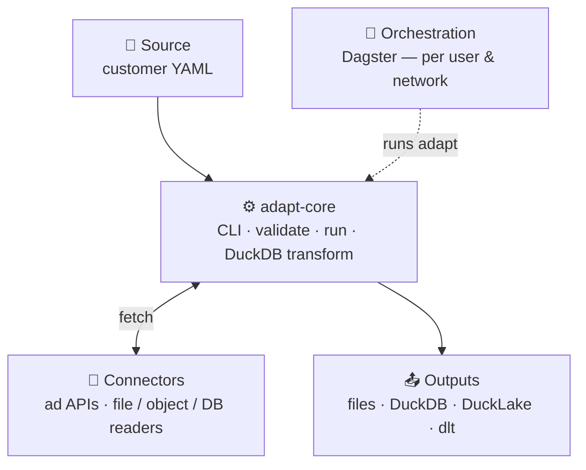
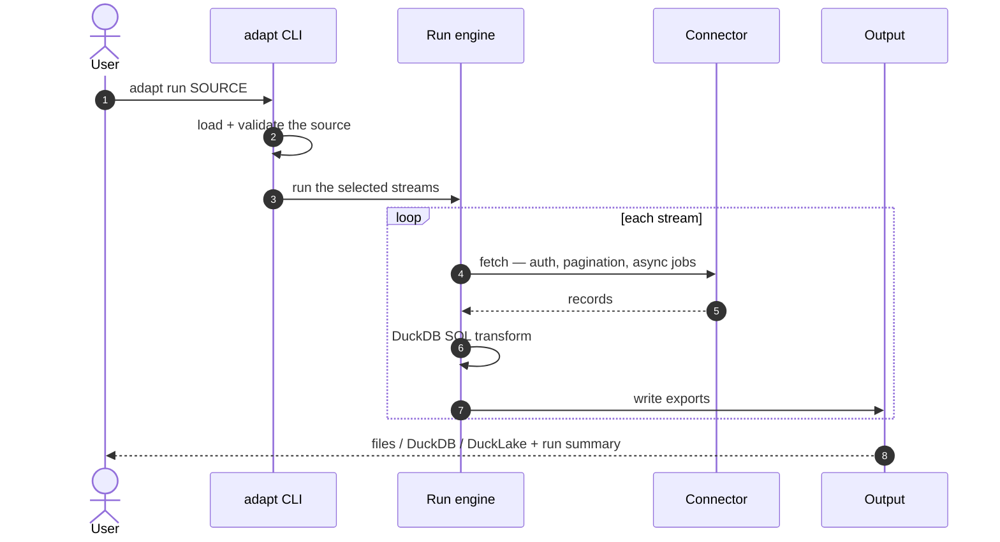
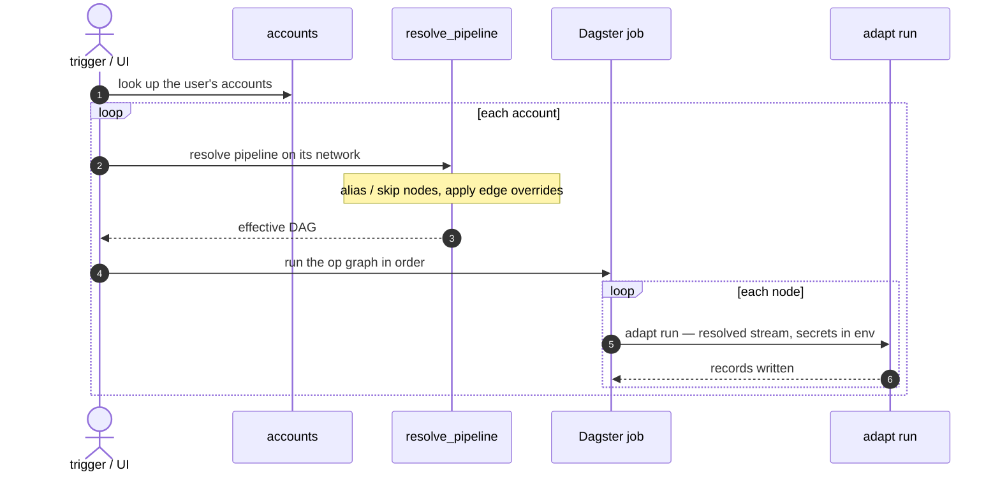
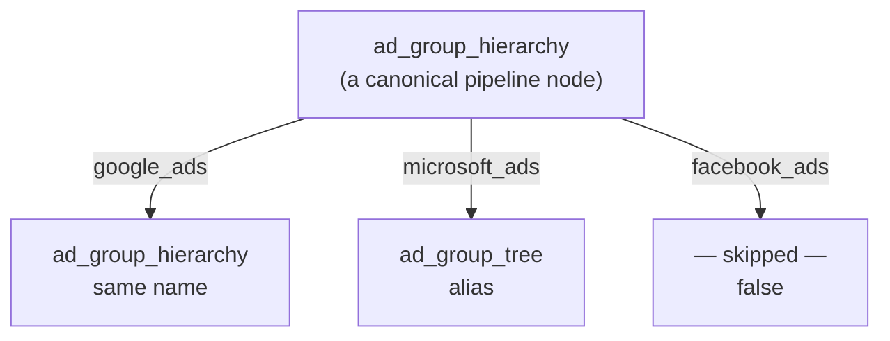
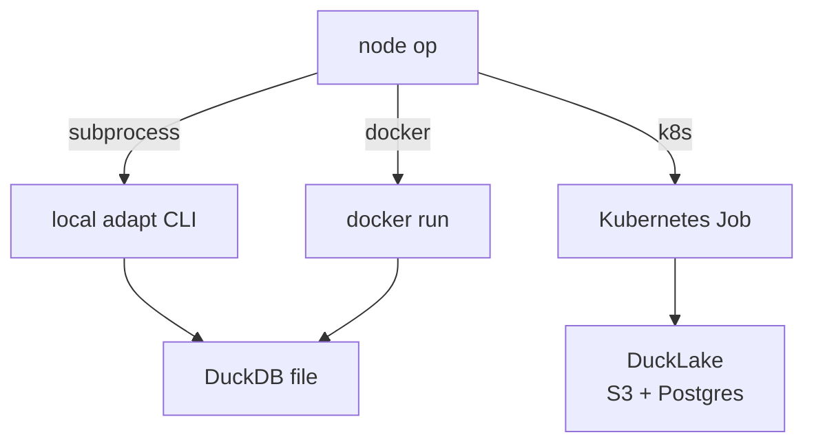

# Architecture
{: .no_toc }

How ADaPT is put together — the layers, the `adapt run` extraction flow, and the orchestration flow that runs it per
user and network.
{: .fs-5 .fw-300 }

  
Contents

{: .text-delta }
1. TOC
{:toc}

---

## The layers

ADaPT is deliberately split so that **what to extract** (a customer's declarative source) is separate from **how to
reach an API** (a connector) and **when and for whom to run** (orchestration).

| Layer | What it owns | Reference |
|---|---|---|
| **Source** | A customer's declarative extraction: inputs (`spec`), sign-in (`auth`), requests, SQL `transform` steps, `export`s. No code. | [source format design]({{ site.baseurl }}/design/source-format) · [`examples/sources/`](https://github.com/karthick-jaganathan/ADaPT-ETL/tree/master/examples/sources) |
| **adapt-core** | The `adapt` CLI, validation, the run engine, the embedded DuckDB transform, and the outputs. Knows nothing about any specific vendor. | [adapt-core docs]({{ site.baseurl }}/adapt-core/) |
| **Connectors** | Vendor access: the ad-API SDKs (with their query builders) and the file/object/db readers. Each is its own distribution under the `adapt.connectors` entry point. | [Packages]({{ site.baseurl }}/packages/) · [connectors/README](https://github.com/karthick-jaganathan/ADaPT-ETL/blob/master/connectors/README.md) |
| **Orchestration** | Running `adapt` per user and network: named pipelines, the shared-vocabulary network map, Dagster op graphs, and the subprocess/Docker/Kubernetes execution modes. | [orchestration docs]({{ site.baseurl }}/orchestration/) |

The CLI never imports a connector directly: connectors register themselves under the `adapt.connectors` entry point and
are discovered at run time (and gated by `--allow-connector`). Orchestration never imports adapt-core: every node shells
out to the `adapt` CLI. These two seams are what keep the layers independent.

---

## The `adapt run` flow

`adapt run <source>` loads a source folder, validates the inputs, then runs each selected stream: its requests fetch
records through a connector, the `transform` steps shape them with SQL on an embedded DuckDB, and the `export`s are
written by the chosen output. Secrets arrive only as `ADAPT_SECRET_*` (or `--secrets`) and are redacted from logs.

The connector is the only vendor-specific part; everything else — partitioning, pagination, async report polling,
incremental state, retries and rate limiting, the SQL transform and the outputs — is adapt-core. Output targets include
Singer messages (default), JSONL/CSV/TSV/Parquet files, a DuckDB file, a **DuckLake** warehouse (Parquet data on object
storage with a catalog), or a [dlt](https://dlthub.com/docs) destination. See the
[adapt-core command line docs]({{ site.baseurl }}/adapt-core/cli/) for every option.

---

## The orchestration flow

Orchestration runs the same `adapt run` for a **user**, across one or more **networks**, on a schedule or on demand.
A *pipeline* is a named DAG of canonical nodes; a *network* maps those canonical nodes to its own source and streams.
`trigger(pipeline, user)` resolves the pipeline onto each of the user's accounts' networks and executes the resulting
Dagster op graph.

Three declarative files drive it, and no code knows anything network-specific:

- **`config/pipelines/<name>.yaml`** — a named DAG of **canonical** node names and their `after` edges (order only).
- **`config/networks.yaml`** — per network: its ADaPT `source`, the `inputs` templates (how to fill the source's
  declared `spec`), the `connectors` and container `image`, and the shared-vocabulary **`streams:`** map (and optional
  **`after:`** edge overrides).
- **`accounts.py`** — the `(user, account, network, …)` rows and each network's app-level secrets file (a database in
  production).

Each node's **wrapper** turns `(node, context)` into the `adapt run` argv and the secret environment. The default
wrapper derives the `--set` flags from the *source's own declared spec* filled by the network's `inputs`; a custom
`@node` wrapper can override a node (e.g. look campaign ids up in a database). See the
[orchestration architecture]({{ site.baseurl }}/orchestration/architecture/) for the
full model.

### Shared vocabulary: one pipeline, many networks

A pipeline names its steps once, as **canonical nodes**. Each network then maps those names to *its own* source
streams — keeping a name, **aliasing** it to a differently-named stream, or marking it **unsupported** (skipped). So one
pipeline definition runs across networks whose sources organise the same data under different names:

A node mapped to a name runs under that stream (an alias); a node mapped `false` is skipped (and drops out of its
dependents' edges); an *unmapped* node is an error, so typos are caught. Each `(pipeline, network)` pair becomes its own
Dagster job, `ads_<pipeline>__<network>`.

---

## Execution modes

The same op graph runs in one of three modes, chosen per run by `ADAPT_EXECUTION`. The op graph, dependency order and
run config are identical across modes — only *where* each node's `adapt run` executes changes.

| Mode | Where a node runs | Warehouse |
|---|---|---|
| `subprocess` (default) | the local `adapt` CLI (`$ADAPT_BIN`) | a local DuckDB file |
| `docker` | a `docker run --rm` of the network's image | a mounted DuckDB file |
| `k8s` | a Kubernetes **Job** (one pod) of that image, created with `kubectl` | **DuckLake**: Parquet data on S3, the catalog in Postgres |

In every mode secrets reach the child **only as environment variables** — never on the command line, in the image, in
the Dagster run config, or in a log. In `docker` the value is copied from the orchestrator's environment into the
container by name (`-e ADAPT_SECRET_<NAME>`); in `k8s` the pod gets the values from a Kubernetes `Secret` via `envFrom`,
so the pipeline sends no secret value at all. The Kubernetes path is a local simulation (a `kind` cluster with in-cluster
LocalStack + Postgres) of a real EKS deployment — see the
[orchestration k8s README](https://github.com/karthick-jaganathan/ADaPT-ETL/tree/master/orchestration/k8s).

---

## Design properties

- **Separation of concerns.** Customers own sources (YAML); adapt-core owns the engine; connectors own vendor access;
  orchestration owns scheduling and fan-out. Each seam is a stable interface (entry points, the `adapt` CLI).
- **Network-agnostic orchestration.** Everything vendor-specific lives in `config/networks.yaml` and the sources;
  adding a network is configuration, not code.
- **Secrets never travel as data.** They are resolved at run time and passed only as `ADAPT_SECRET_*` environment
  variables, redacted from every log, and absent from argv and run config.
- **One flow, many runtimes.** The same op graph runs locally, in Docker, or as Kubernetes Jobs writing to an
  object-storage warehouse — without changing the pipeline.
