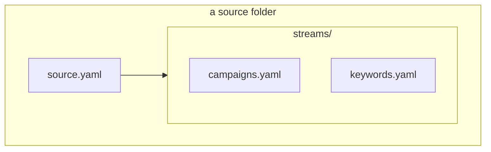
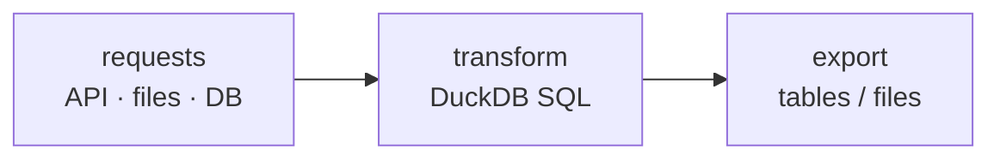

# Concepts
{: .no_toc }

The vocabulary used throughout ADaPT, from a single source file to orchestrated pipelines.
{: .fs-5 .fw-300 }

  
Contents

{: .text-delta }
1. TOC
{:toc}

---

## Extraction

### Source

A **source** is a folder that declares *what to extract*, entirely in YAML — no code. It has a `source.yaml` and one
file per **stream** under `streams/`:

One source folder is shared by every client; a client's settings (never secrets) live in a small `--config` file.

### source.yaml — spec, auth, http

- **`spec`** — the inputs the source declares: `config` (plain values, filled with `--set` or `--config`) and
  `secrets` (filled only from `--secrets` or `ADAPT_SECRET_<NAME>`).
- **`auth`** — how to sign in: a built-in HTTP flow, or a connector `provider` that builds a vendor SDK client.
- **`http`** — base URL, headers and defaults for HTTP requests.

### Stream

A **stream** is one dataset (campaigns, keywords, daily performance…). Each stream fetches, shapes and exports:

- **request** — one call: an HTTP request, or a connector `sdk` call (with partitions, pagination and async report
  jobs handled for you). Its raw rows become a table for the SQL.
- **transform / step** — a sandboxed **DuckDB SQL** `SELECT` over the request tables (and earlier steps) that shapes
  the records.
- **export** — the step whose rows are written out, with a primary key for incremental merges.

### Connector

A **connector** is an installable package that gives a source access to a vendor: the ad-API SDKs
(`google_ads`, `microsoft_ads`, `facebook_ads`) and the readers (`files`, `s3`, `gcs`, `postgres`). Connectors register
under the `adapt.connectors` entry point and are discovered at run time; `--allow-connector` restricts which may load.
A **query builder** (e.g. GAQL) is the sibling kind of component that writes a query language.

### Output

Where a run's exports go: **Singer** messages (default, on stdout), **JSONL / CSV / TSV / Parquet** files, a **DuckDB**
file, a **DuckLake** warehouse (Parquet data on object storage with a catalog), or a **dlt** destination. See
[Outputs]({{ site.baseurl }}/adapt-core/outputs/).

### Partitions, windows & incremental state

A request can fan out over **partitions** (e.g. one per account), and an **incremental** stream reads day **windows**
from a saved cursor forward, so each run only fetches new data. See [Streams]({{ site.baseurl }}/adapt-core/streams/).

---

## Orchestration

Orchestration runs the `adapt` CLI for many users and networks as Dagster pipelines. See
[Orchestration]({{ site.baseurl }}/orchestration/).

### Pipeline & node

A **pipeline** is a named DAG (`config/pipelines/<name>.yaml`) of **canonical nodes** and their `after` edges — order
only. A **node** maps to a source stream.

### Network & shared vocabulary

A **network** (`config/networks.yaml`) maps a pipeline's canonical nodes to *its own* source and stream names. Its
`streams:` map **aliases** a node to a differently-named stream or marks it **`false`** (unsupported → skipped). This
**shared vocabulary** lets one pipeline run across Google, Microsoft and Facebook even though they name streams
differently.

### Account, wrapper & execution mode

- **account** — a `(user, account, network)` row a trigger fans out over.
- **wrapper** — builds a node's `adapt run` command from the source's declared spec and the network's inputs.
- **execution mode** — where each node runs: a local **subprocess**, a **Docker** container, or a **Kubernetes Job**
  (writing to an object-storage DuckLake warehouse).

---

## Commands at a glance

| Command | Does |
|---|---|
| `adapt run SOURCE` | runs a source's streams and writes the chosen output |
| `adapt validate [PATH ...]` | checks sources (and the installed connectors) without running them |
| `adapt connectors` | lists the installed connectors, grouped by category |

See the [API Reference]({{ site.baseurl }}/api-reference/) and [adapt-core]({{ site.baseurl }}/adapt-core/) for the full
detail.
