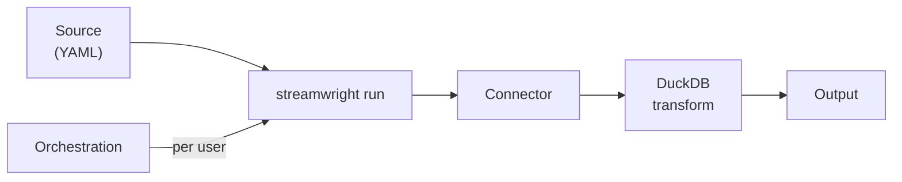

<div class="hero-section">
  <h1>🚀 StreamWright</h1>
  <p class="subtitle">Extract data from APIs, files and databases with YAML source configurations, shape it with SQL, and write it to files or a warehouse.</p>

  <div class="badges">
    
    
    
  </div>

  <div>
    <a href="{{ site.baseurl }}/installation" class="btn btn-primary">Get Started</a>
    <a href="https://github.com/karthick-jaganathan/streamwright" class="btn btn-outline">View on GitHub</a>
  </div>
</div>

## What is StreamWright?

StreamWright turns a few **YAML files** into a working data pipeline. You describe *what* to pull — from an **API, a file
store, or a database** — and StreamWright handles the *how*: signing in, paging, retries, shaping the data with SQL, and
writing it out. No per-connector code, and one command runs any source.

## How it works

A **source** is a folder of YAML. `streamwright run` executes it in three steps:



1. **Fetch** — each stream pulls records through a **connector** (an API, files, or a database).
2. **Shape** — `transform` steps reshape the records with **DuckDB SQL**.
3. **Write** — the result lands in the **output** you choose: files, DuckDB, DuckLake, or a dlt destination.

Run a source once from the command line, or let **orchestration** run it on a schedule — one pipeline across many
accounts and networks. Two commands cover day-to-day use:

- **`streamwright run`** — run a source (auth, paging, async report jobs, incremental state, retries and rate limits built in).
- **`streamwright validate`** — check sources without running them, with the file, line and path of every finding.

## Explore the docs

<div class="feature-grid">
  <div class="feature-card">
    <h3><a href="{{ site.baseurl }}/quickstart/">🚀 Quickstart</a></h3>
    <p>Install, validate and run your first source in five minutes.</p>
  </div>

  <div class="feature-card">
    <h3><a href="{{ site.baseurl }}/concepts/">🧩 Concepts</a></h3>
    <p>Sources, streams, connectors, pipelines, networks and execution modes — the vocabulary.</p>
  </div>

  <div class="feature-card">
    <h3><a href="{{ site.baseurl }}/architecture/">🏗️ Architecture</a></h3>
    <p>The layers and the <code>streamwright run</code> + orchestration flows, with sequence diagrams.</p>
  </div>

  <div class="feature-card">
    <h3><a href="{{ site.baseurl }}/core/">⚙️ streamwright</a></h3>
    <p>The CLI and runtime: commands, streams, outputs, logging, connectors and the Python API.</p>
  </div>

  <div class="feature-card">
    <h3><a href="{{ site.baseurl }}/orchestration/">🔀 Orchestration</a></h3>
    <p>Dagster pipelines over the <code>streamwright</code> CLI, the shared-vocabulary network map, and execution modes.</p>
  </div>

  <div class="feature-card">
    <h3><a href="{{ site.baseurl }}/examples/">💡 Examples</a></h3>
    <p>Task-oriented recipes for the example sources, from local files to ad platforms.</p>
  </div>

  <div class="feature-card">
    <h3><a href="{{ site.baseurl }}/installation/">🛠️ Installation</a></h3>
    <p>Install streamwright and the connectors, verify, Docker and development setup.</p>
  </div>

  <div class="feature-card">
    <h3><a href="{{ site.baseurl }}/api-reference/">📖 API Reference</a></h3>
    <p>Every <code>streamwright</code> command and option, and the Python entry points.</p>
  </div>
</div>

## Quick start

```bash
git clone https://github.com/karthick-jaganathan/streamwright.git
cd streamwright
make install && make install-connectors

streamwright connectors                                  # list the installed connectors
streamwright validate examples/sources                   # check every example source
streamwright run examples/sources/readers/files_demo \
  --set data_root=examples/sources/readers/files_demo/data --allow-connector files --output jsonl:out/
```

New here? Follow the [Quickstart]({{ site.baseurl }}/quickstart/) for a guided five-minute tour.

## Contributing

See the [contributing guide]({{ site.baseurl }}/contributing).

## License

Apache License 2.0.

## Support

Report bugs and request features on [GitHub Issues](https://github.com/karthick-jaganathan/streamwright/issues).
